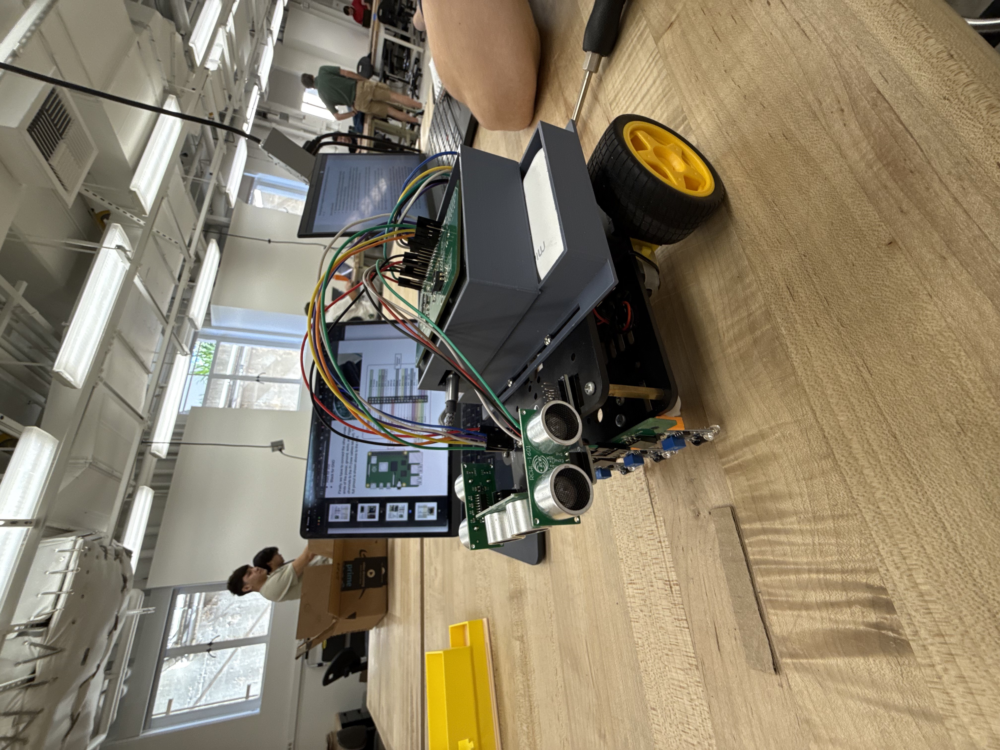

# 🏆 PRIZE-FETCHING AUTONOMOUS ROBOT  
**FINAL PROJECT — ME/CS/EE 129: SPRING 2024–25**  

---

## **OVERVIEW**  
This repository contains the final project for **ME/CS/EE 129: Experimental Robotics**, showcasing an **autonomous prize-fetching robot**. The robot is designed to:  

- Explore and map a **grid-based environment** from scratch  
- Detect prizes using onboard **sensors and markers**  
- Plan and execute **shortest-path routes** in real time  
- Pick up and return prizes using a **rear-mounted electromagnet**  
- Compete in a **dynamic multi-agent environment** where multiple robots operate simultaneously  

The software leverages **multithreading** and **ROS2 messaging** to handle sensing, planning, and actuation concurrently.  

---

## **GAME CONCEPT**  
The competition involves **10 autonomous robots** navigating a structured map with magnetic prizes scattered across the grid. Robots compete in two modes:  

1. **ASSIGNED GOAL MODE**  
   - The robot receives a specific prize ID via ROS2.  
   - Objective: Locate and fetch that prize only.  

2. **FREE-FOR-ALL MODE**  
   - Time limit: **5 minutes**  
   - Objective: Maximize score by collecting as many prizes as possible  

### **ROBOT WORKFLOW**  
- Starts from a designated **home dead-end** (also the drop-off zone)  
- Scans **NFC tags** at intersections to retrieve prize-related data  
- Detects **101-pattern tape markers** in streets that indicate prize pickup points  
- Performs a **pickup maneuver** with the electromagnet  
- Returns to the home base and drops the prize to score  

---

## **MAP & NAVIGATION**  
The playing field is a **grid of intersections and streets**:  

- **Intersections** contain embedded NFC tags with encoded prize data  
- **Dead-ends** act as starting locations and drop-off points  
- **101 tape markers** designate prize pickup zones  

Since the **map is unknown at the start**, the robot dynamically builds and updates its internal map. Pathfinding is performed using **Dijkstra’s algorithm** for efficient navigation.  

---

## **FEATURES & BEHAVIORS**  
- **AUTONOMOUS EXPLORATION**: Systematically explores unknown intersections, identifies dead-ends, and avoids revisiting loops  
- **PRIZE LOCALIZATION**: Uses NFC-based distance readings to narrow down potential prize positions  
- **PATH PLANNING**: Employs Dijkstra’s algorithm for optimal routing under dynamic conditions  
- **OBSTACLE AVOIDANCE**: Detects and avoids collisions with other robots via proximity sensors  
- **PICKUP MANEUVER**: Executes a **backup–turn–forward** compound action to precisely align the electromagnet over the prize  
- **DROPOFF PROTOCOL**: Returns to home dead-end, performs a **180° turn**, and safely deactivates the electromagnet  

---

## **HARDWARE COMPONENTS**  
- Line-following IR sensor array  
- Magnetometer (heading and orientation tracking)  
- NFC reader (prize information at intersections)  
- Electromagnet (for prize pickup)  
- Proximity sensor (collision avoidance)  
- Motor driver + encoders (movement control)  
- Raspberry Pi (or equivalent controller) running **Python + ROS2**  

<p align="center">
  
</p>

---

## **SOFTWARE ARCHITECTURE**  

### **MULTITHREADED SYSTEM**  
- **BRAIN THREAD**: Core decision-making, goal selection, and planning  
- **SENSOR THREAD**: Continuously polls IR, magnetometer, and proximity data  
- **UI THREAD**: Supports manual/debug input (keyboard or CLI)  
- **ROS THREAD**: Subscribes to NFC/prize data, listens for assignments, and handles inter-robot communication  

### **CORE MODULES**  
- `main.py` — Initializes all threads, manages shared state  
- `brain.py` — Implements exploration, goal-seeking, and decision logic  
- `map.py` — Stores grid map, intersections, and computes shortest paths  
- `behaviors.py` — Low-level robot actions (line following, turning, pickup/dropoff)  
- `ros.py` — Handles ROS2 communication and message decoding  

---

## **ROS2 COMMUNICATION**  

At the beginning of each round, the robot receives ROS2 messages:  

- **NFC DATA DICTIONARY**: Maps NFC tag IDs to distances of nearby prizes  
- **PRIZE INFO DICTIONARY**: Maps prize IDs to value and pickup heading  
- **OPTIONAL ASSIGNED PRIZE ID** (for goal mode)  

Example:  

```python
nfc_data = {
  "N1": {"P1": {"distance": 3.5}, "P2": {"distance": 2.5}}
}

prize_info = {
  "P1": {"value": 10, "heading": 3},
  "P2": {"value": 5, "heading": 1}
}
